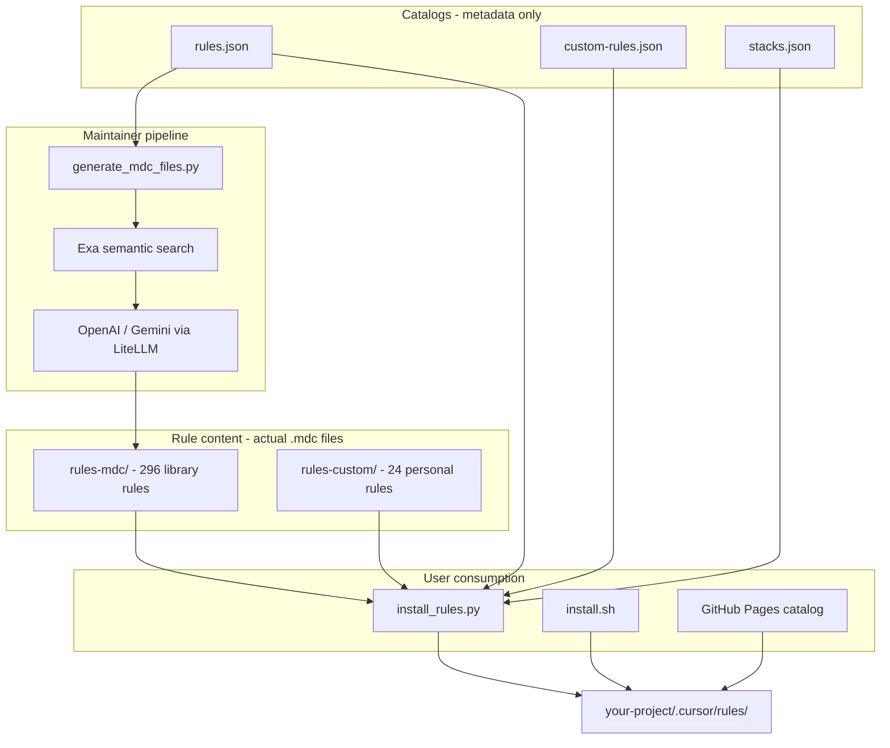

# Complete Usage Guide

This document is the full reference for **awesome-cursor-rules-mdc** — what it is, how it works, and every way to use it.

> **Fork:** [tarunmittal-impact-analytics/awesome-cursor-rules-mdc](https://github.com/tarunmittal-impact-analytics/awesome-cursor-rules-mdc)  
> **Upstream:** [sanjeed5/awesome-cursor-rules-mdc](https://github.com/sanjeed5/awesome-cursor-rules-mdc)  
> **Web catalog:** https://tarunmittal-impact-analytics.github.io/awesome-cursor-rules-mdc/

---

## Table of contents

1. [What is this repo?](#what-is-this-repo)
2. [What are Cursor rules?](#what-are-cursor-rules)
3. [What's inside this repo](#whats-inside-this-repo)
4. [How this repo works end to end](#how-this-repo-works-end-to-end)
5. [Rules vs stacks — what's the difference?](#rules-vs-stacks--whats-the-difference)
6. [Why so many files?](#why-so-many-files)
7. [Simple mental model](#simple-mental-model)
8. [Rule catalog overview](#rule-catalog-overview)
9. [Quick start — set up a new project](#quick-start--set-up-a-new-project)
10. [All ways to install rules](#all-ways-to-install-rules)
11. [Install methods compared](#install-methods-compared)
12. [CLI reference (`install_rules.py`)](#cli-reference-install_rulespy)
13. [Curl installer reference (`install.sh`)](#curl-installer-reference-installsh)
14. [Web catalog](#web-catalog)
15. [Preset stacks](#preset-stacks)
16. [Personal / custom rules](#personal--custom-rules)
17. [Example workflows by project type](#example-workflows-by-project-type)
18. [Generating library rules (maintainers)](#generating-library-rules-maintainers)
19. [Adding your own custom rules](#adding-your-own-custom-rules)
20. [Fork configuration](#fork-configuration)
21. [GitHub Pages setup](#github-pages-setup)
22. [After installing — using rules in Cursor](#after-installing--using-rules-in-cursor)
23. [Troubleshooting](#troubleshooting)

---

## What is this repo?

This repo is a **Cursor rules library and toolkit**. It provides:

1. **296 library rules** (`rules-mdc/`) — best-practice MDC files for frameworks, databases, data engineering, cloud, AI, and more.
2. **24 personal/custom rules** (`rules-custom/`) — hand-written workflow, architecture, security, RAG, and distributed systems rules.
3. **Install tooling** — CLI, curl script, and web catalog to copy rules into any project's `.cursor/rules/` folder.
4. **Rule generator** — scripts to create new library rules (requires API keys).

You do **not** need to clone this repo to use the rules. You can install directly from GitHub with curl or the web catalog.

---

## What are Cursor rules?

Cursor rules are persistent instructions that tell the AI how to behave in your project. They live in:

```
your-project/
  .cursor/
    rules/
      base.mdc
      react.mdc
      fastapi.mdc
```

Each `.mdc` file has YAML frontmatter + markdown content:

```markdown
---
description: React best practices
globs: **/*.{jsx,tsx}
alwaysApply: false
---

# React rules
- Prefer functional components
- ...
```

| Frontmatter field | Purpose |
|-------------------|---------|
| `description` | What the rule covers (used by Cursor to decide relevance) |
| `globs` | File patterns — rule applies when editing matching files |
| `alwaysApply: true` | Rule is always included in AI context |

**Alternative:** Cursor also supports `AGENTS.md` (plain markdown, no metadata). This repo uses `.mdc` files in `.cursor/rules/` because they support globs, multiple focused rules, and conditional application.

---

## What's inside this repo

```
.
├── rules-mdc/              # 296 library rules (react.mdc, clickhouse.mdc, …)
├── rules-custom/         # 24 personal/custom rules (RAG, security, architecture, …)
├── rules.json            # Catalog of all library rules + tags
├── custom-rules.json     # Catalog of personal rules
├── stacks.json           # Preset bundles (python-backend, personal, …)
├── repo.json             # Fork URL config (owner/repo, branch)
├── install.sh            # Curl installer (no Python needed)
├── docs/                 # Web catalog (GitHub Pages)
│   ├── index.html
│   └── catalog.json
└── src/
    ├── install_rules.py      # CLI installer
    ├── generate_mdc_files.py # LLM + Exa rule generator
    ├── generate_template_mdc.py  # Template fallback (no API keys)
    ├── generate_catalog.py   # Build web catalog + sync URLs
    └── repo_config.py        # Resolve fork URLs
```

### Two rule types

| Type | Directory | Count | Source | Install prefix |
|------|-----------|-------|--------|----------------|
| **Library** | `rules-mdc/` | 296 | Generated / template + LLM | `react`, `fastapi`, `clickhouse` |
| **Personal** | `rules-custom/` | 24 | Hand-written | `custom:base` or `--custom base` |

---

## How this repo works end to end

This repo is two things at once: a **library of Cursor AI rules** and a **toolkit to install and generate them**. The flow is: define what exists → generate content → install into your project → Cursor uses those rules when you code.

### Repo architecture



### The JSON files — what each one does

These are **indexes/catalogs**. They don't contain rule content — they describe what exists and how to find it.

#### `rules.json` — Library rule catalog (296 entries)

The master list of **technology-specific rules** (frameworks, databases, cloud services, etc.).

```json
{
  "libraries": [
    {
      "name": "clickhouse",
      "tags": ["database", "analytics", "sql", "columnar", "data-engineering"]
    }
  ]
}
```

| Role | Detail |
|------|--------|
| Source of truth | Which library rules exist |
| Tags | Power search/filter (`--tag data-engineering`, web catalog filters) |
| Generator input | Add an entry here, run `generate_mdc_files.py`, get `rules-mdc/clickhouse.mdc` |
| Does not contain | The rule text itself |

#### `custom-rules.json` — Personal/custom rule catalog (24 entries)

Index for **hand-written workflow and architecture rules** — not tied to a single library.

```json
{
  "rules": [
    {"name": "base", "description": "Base behavior for all tasks", "tags": ["personal", "custom", "always-apply"]},
    {"name": "graph-rag", "description": "Graph RAG with knowledge graphs", "tags": ["personal", "custom", "ai", "rag"]}
  ]
}
```

| Role | Detail |
|------|--------|
| Purpose | Your team's coding philosophy, not "how to use React" |
| Topics | Architecture, RAG, security, distributed systems, token optimization, etc. |
| Install prefix | `custom:base`, `custom:graph-rag`, or `--custom base` |

#### `stacks.json` — Preset bundles (152 stacks)

Curated **multi-rule bundles** for common project types. One command installs a whole setup.

```json
{
  "stacks": {
    "data-stack-kafka": {
      "description": "Apache Kafka event streaming",
      "rules": ["apache-kafka", "docker", "python"]
    },
    "personal": {
      "description": "Personal workflow rules",
      "rules": ["custom:base", "custom:simple", "custom:complex", "custom:frontend", "custom:backend"]
    },
    "gen-ai-graph-rag": {
      "rules": ["custom:base", "custom:graph-rag", "custom:rag-development", "langchain", "pinecone"]
    }
  }
}
```

| Role | Detail |
|------|--------|
| Purpose | Avoid picking 5–10 rules manually for every new project |
| Mixing | Combines library rules (`react`) and personal rules (`custom:base`) |
| Usage | `--stack data-stack-kafka` in CLI or curl installer |

#### `repo.json` — Fork configuration

```json
{
  "repo": "tarunmittal-impact-analytics/awesome-cursor-rules-mdc",
  "branch": "main"
}
```

Points install scripts and GitHub raw URLs at your fork so curl/CLI fetch from the right place.

### The two rule directories

| | `rules-mdc/` | `rules-custom/` |
|---|---|---|
| **Count** | 296 | 24 |
| **Content** | Technology best practices | Workflow, architecture, patterns |
| **How created** | Generated (Exa + LLM) or template fallback | Hand-written |
| **Examples** | `react.mdc`, `clickhouse.mdc`, `apache-kafka.mdc` | `base.mdc`, `graph-rag.mdc`, `authentication.mdc` |
| **Install as** | `react`, `clickhouse` | `custom:base`, `custom:graph-rag` |

- **Library rules** answer: *"How should I write code for this technology?"*
- **Personal rules** answer: *"How should the AI behave on my team?"*

Example personal rule (`rules-custom/base.mdc`):

```markdown
---
description: Base behavior for all tasks
alwaysApply: true
---

# Core behavior
- Be concise. Don't explain standard patterns unless asked.
- Focus on what's unique about the change being made.
- ...
```

### Generation pipeline (maintainers)

When you add a new library to `rules.json`, you generate its `.mdc` file:

```
rules.json entry
    ↓
generate_mdc_files.py
    ↓
Exa search (best practices for library)  ← needs EXA_API_KEY
    ↓
OpenAI / Gemini (synthesize into .mdc)   ← needs OPENAI_API_KEY or GEMINI_API_KEY
    ↓
rules-mdc/{name}.mdc
    ↓
mdc_generation_progress.json (tracks completed/failed)
```

Key files:

| File | Purpose |
|------|---------|
| `src/config.yaml` | LLM model, workers, rate limits |
| `src/mdc-instructions.txt` | Prompt template for generation |
| `src/generate_template_mdc.py` | Fallback when API keys fail (generic boilerplate) |
| `src/exa_results/` | Cached Exa research per library |

If generation fails (bad API key), you get thin template rules instead of rich Exa+LLM content.

### Installation flow (users)

You **do not need to clone the repo** to use rules. Three install paths:

**CLI:**
```bash
uv run src/install_rules.py install react fastapi --here
uv run src/install_rules.py install --stack data-stack-kafka --here
uv run src/install_rules.py install --custom base graph-rag --here
```

**Curl (no Python):**
```bash
curl -fsSL https://raw.githubusercontent.com/tarunmittal-impact-analytics/awesome-cursor-rules-mdc/main/install.sh | bash -s -- --stack gen-ai-graph-rag --here
```

**Web catalog:** https://tarunmittal-impact-analytics.github.io/awesome-cursor-rules-mdc/

What install does:

1. Reads `rules.json` / `custom-rules.json` / `stacks.json` to resolve names
2. Copies `.mdc` files from GitHub raw URLs (or local clone) into `your-project/.cursor/rules/`
3. Cursor picks them up automatically

### Deploy / catalog

```
Push to main (rules-mdc/** changes)
    ↓
.github/workflows/pages.yml
    ↓
generate_catalog.py → docs/catalog.json
    ↓
GitHub Pages → web catalog with search, tags, install commands
```

`docs/catalog.json` merges all three catalogs (library + custom + stacks) for the web UI.

### Typical workflows

**New Kafka + Python data project:**
```bash
curl -fsSL .../install.sh | bash -s -- --stack data-stack-kafka --here
# Installs: apache-kafka.mdc, docker.mdc, python.mdc
```

**Gen-AI RAG app with your team's conventions:**
```bash
curl -fsSL .../install.sh | bash -s -- --stack gen-ai-graph-rag --here
# Installs: custom:base, custom:graph-rag, langchain, pinecone, etc.
```

**Just your personal workflow rules:**
```bash
curl -fsSL .../install.sh | bash -s -- --stack personal --here
# Installs: custom:base, custom:simple, custom:complex, custom:frontend, custom:backend
```

**Add a new library to the repo (maintainer):**

1. Add entry to `rules.json` (or `src/new_rules_batch.json` + merge script)
2. `uv run src/generate_mdc_files.py --library new-lib`
3. `uv run src/generate_catalog.py`
4. Commit + push → auto-deploys to GitHub Pages

### Summary table

| Artifact | Role |
|----------|------|
| `rules.json` | Index of 296 library/tech rules + tags |
| `custom-rules.json` | Index of 24 personal/workflow rules |
| `stacks.json` | 152 preset bundles mixing library + custom rules |
| `rules-mdc/` | Generated tech-specific rule **content** |
| `rules-custom/` | Hand-written team/workflow rule **content** |
| `repo.json` | Fork URL config for installers |
| `install_rules.py` / `install.sh` | Copy rules into `.cursor/rules/` |
| `generate_mdc_files.py` | Create library rules via Exa + LLM |
| `docs/catalog.json` + Pages | Browse/search/install UI |

**In one sentence:** JSON files describe *what* rules exist and how to bundle them; `.mdc` files are the actual AI instructions; install tooling copies the right ones into your project; Cursor reads them and codes accordingly.

> **Web docs:** The same concepts are available on GitHub Pages — [Documentation](https://tarunmittal-impact-analytics.github.io/awesome-cursor-rules-mdc/guide.html) | [Browse catalog](https://tarunmittal-impact-analytics.github.io/awesome-cursor-rules-mdc/)

---

## Rules vs stacks — what's the difference?

Think of it like a menu vs a combo meal.

### Rule = one instruction file (the actual content)

A **rule** is a single `.mdc` file with real AI instructions.

```
rules-mdc/react.mdc          ← library rule (how to write React)
rules-custom/base.mdc        ← personal rule (how AI should behave)
```

When you install a rule, one file lands in your project:

```
my-app/.cursor/rules/react.mdc
```

### Stack = a shortcut list (no content of its own)

A **stack** is just a **named bundle of rule names** in `stacks.json`. It has no `.mdc` file.

```json
"data-stack-kafka": {
  "description": "Apache Kafka event streaming",
  "rules": ["apache-kafka", "docker", "python"]
}
```

When you run `--stack data-stack-kafka`, the installer:

1. Looks up the list in `stacks.json`
2. Copies **3 separate rule files** into your project

```
my-app/.cursor/rules/
  apache-kafka.mdc   ← from rules-mdc/
  docker.mdc         ← from rules-mdc/
  python.mdc         ← from rules-mdc/
```

| | **Rule** | **Stack** |
|---|---|---|
| What it is | Content (instructions) | A shopping list |
| File type | `.mdc` | Entry in `stacks.json` |
| Install as | `react`, `custom:base` | `--stack react-ts` |
| Can mix types? | One rule at a time | Yes — e.g. `custom:base` + `react` |

**Analogy:** Rules are ingredients. Stacks are recipes that say which ingredients to grab.

### Three things users need to know

| Concept | Command | Installs |
|---------|---------|----------|
| Library rule | `install react` | One tech rule file |
| Personal rule | `--custom base` | One workflow rule file |
| Stack | `--stack react-ts` | Multiple rule files at once |

---

## Why so many files?

Most of the volume is **the product itself**, not clutter.

| What | Count | Why it exists |
|------|-------|---------------|
| `rules-mdc/*.mdc` | ~296 | One file per technology — this **is** the rule library |
| `rules-custom/*.mdc` | 24 | Hand-written team/workflow rules |
| `rules.json` | 1 | Index of library rules (names + tags) |
| `custom-rules.json` | 1 | Index of personal rules |
| `stacks.json` | 1 | Preset bundles (lists of rule names) |
| `src/` | ~75 | Generator, installer, Exa cache — **maintainers only** |

You can't collapse the ~320 `.mdc` files without losing granularity — each rule is meant to be installed individually.

What can feel noisy (but has a purpose):

- **3 JSON catalogs** — different indexes for library rules, personal rules, and stacks
- **Generator artifacts** in `src/exa_results/`, `src/logs/` — maintainer-only, not needed for users
- **Multiple markdown docs** — `GUIDE.md` (full reference), `README.md` (overview), web docs on GitHub Pages

**As a user**, you only need three concepts: `install react` (rule), `--stack react-ts` (stack), `--custom base` (personal).

---

## Simple mental model

```
rules.json          → "what library rules exist"
custom-rules.json   → "what personal rules exist"
stacks.json         → "recommended combos for project types"

rules-mdc/          → the actual library rule files
rules-custom/       → the actual personal rule files

install             → copies .mdc files into your project
generate            → creates new .mdc files (maintainers only)
```

| Who | What you touch |
|-----|----------------|
| **User** | Install commands, web catalog, stacks |
| **Maintainer** | `rules.json`, generator, `generate_catalog.py`, push to deploy |

---

## Rule catalog overview

### Library rules by category (296 total)

| Category | Key rules |
|----------|-----------|
| **Languages** | python, javascript, typescript, go, rust, swift, kotlin, java |
| **Backend / API** | fastapi, django, flask, express, nestjs, fiber, actix-web |
| **Frontend** | react, next-js, vue, angular, svelte, tailwind, shadcn, radix-ui, framer-motion |
| **Databases (SQL)** | postgresql, mysql, clickhouse, duckdb, sqlite, sql |
| **Databases (NoSQL)** | mongodb, cassandra, redis, memcached, elasticsearch, neo4j |
| **Data engineering** | apache-kafka, apache-spark, apache-flink, apache-airflow, dbt, prefect, dagster, apache-beam, trino, delta-lake |
| **Data warehouses** | snowflake, google-bigquery, databricks |
| **Cloud AWS** | aws, aws-lambda, aws-glue, aws-emr, aws-kinesis, aws-sqs, aws-sns, aws-secrets-manager, boto3 |
| **Cloud GCP** | gcp, google-bigquery, google-pubsub, google-dataflow, google-secret-manager, google-cloud-run |
| **Cloud Azure** | azure, azure-data-factory, azure-key-vault, azure-service-bus |
| **Gen AI / LLM** | langchain, langgraph, openai, anthropic, crewai, autogen, haystack, langsmith |
| **Vector DBs** | pinecone, chromadb, weaviate, qdrant, milvus |
| **Mobile** | flutter, react-native, expo, swift, swiftui, kotlin, ios-development, android-sdk, jetpack-compose |
| **DevOps / infra** | docker, kubernetes, terraform, ansible, datadog, github-actions, nginx |
| **Testing** | pytest, jest, vitest, playwright, cypress |

Search the full catalog:
```bash
uv run src/install_rules.py search clickhouse
uv run src/install_rules.py list --tag data-engineering
uv run src/install_rules.py list --tag gen-ai
```

---

## Quick start — set up a new project

### Option A: Personal rules only (fastest)

```bash
cd ~/my-new-project

curl -fsSL https://raw.githubusercontent.com/tarunmittal-impact-analytics/awesome-cursor-rules-mdc/main/install.sh \
  | bash -s -- --custom-all --here
```

Installs: `base`, `simple`, `complex`, `frontend`, `backend` into `.cursor/rules/`.

### Option B: Personal + stack (recommended)

```bash
cd ~/my-new-project

# FastAPI backend
curl -fsSL https://raw.githubusercontent.com/tarunmittal-impact-analytics/awesome-cursor-rules-mdc/main/install.sh \
  | bash -s -- --stack personal-python-backend --here

# React TypeScript frontend
curl -fsSL https://raw.githubusercontent.com/tarunmittal-impact-analytics/awesome-cursor-rules-mdc/main/install.sh \
  | bash -s -- --stack personal-react-ts --here
```

### Option C: Library stack only

```bash
curl -fsSL https://raw.githubusercontent.com/tarunmittal-impact-analytics/awesome-cursor-rules-mdc/main/install.sh \
  | bash -s -- --stack python-backend --here
```

### Commit rules to git

```bash
git add .cursor/rules
git commit -m "Add Cursor rules for project"
```

---

## All ways to install rules

| Method | Requires clone? | Requires Python? | Best for |
|--------|-----------------|------------------|----------|
| **Curl** (`install.sh`) | No | No* | Quick one-liner from any terminal |
| **Quick install** (`quick_install.py`) | No | Yes (python3) | Aliases, stacks, tags from any project |
| **CLI** (`install_rules.py`) | Yes** | Yes (uv) | Browse, search, dry-run, local dev |
| **Web catalog** | No | No | Visual browse, download, copy commands |
| **Manual copy** | No | No | Single rule, full control |

\* Python 3 required for `--stack`, `--tag`, `--alias`, `--custom-all` in `install.sh`.  
\*\* Script must exist locally — use full path or clone the repo. Do **not** run `uv run src/install_rules.py` from your app folder unless that path exists.

### Install from any project (important)

If you are inside `~/backend` or any app repo, this **will fail**:

```bash
uv run src/install_rules.py install --custom acid-properties --here --source github
# error: No such file or directory — src/install_rules.py is not in your app
```

`--source github` only downloads rule **files** from GitHub. You still need the installer script itself.

**Use one of these instead (from inside your project):**

```bash
# Recommended — curl + install.sh
curl -fsSL https://raw.githubusercontent.com/tarunmittal-impact-analytics/awesome-cursor-rules-mdc/main/install.sh \
  | bash -s -- --custom acid-properties --here

# Friendly alias (python backend, mern, gen ai, …)
curl -fsSL .../install.sh | bash -s -- --alias "python backend" --here

# quick_install.py — stacks, tags, aliases, rule names
curl -fsSL .../src/quick_install.py | python3 - --here --custom acid-properties
curl -fsSL .../src/quick_install.py | python3 - --here --alias "python backend"
curl -fsSL .../src/quick_install.py | python3 - --here --stack backend-e2e-fastapi
curl -fsSL .../src/quick_install.py | python3 - --here --tag python --custom base
curl -fsSL .../src/quick_install.py | python3 - --list-aliases
```

**Only if you cloned the rules repo**, use full path:

```bash
uv run ~/path/to/awesome-cursor-rules-mdc/src/install_rules.py \
  install --custom acid-properties --here --source github
```

### Download .mdc files

| Method | Command |
|--------|---------|
| Web catalog | Click **Download** on any rule card |
| Raw GitHub URL | `curl -fsSL .../rules-mdc/react.mdc -o react.mdc` |
| quick_install.py | `python3 quick_install.py --download react --output ./react.mdc` |
| Personal rule | `python3 quick_install.py --download custom:acid-properties -o acid-properties.mdc` |

Download the installer script:

```bash
curl -fsSL .../src/quick_install.py -o quick_install.py
# Also available on GitHub Pages: .../quick_install.py
```

### Friendly aliases (`install_aliases.json`)

Natural names map to stacks or tags — no need to memorize stack IDs:

| Alias | Resolves to |
|-------|-------------|
| `python backend` | Stack `backend-e2e-fastapi` |
| `mern` | Stack `mern-full` |
| `pern` | Stack `pern-full` |
| `t3` | Stack `t3-stack-full` |
| `gen ai` | Stack `fullstack-genai-e2e` |
| `gen ai backend` | Stack `genai-python-backend-e2e` |
| `data engineering` | Tag `data-engineering` (all matching library rules) |
| `personal` | Stack `personal` |

```bash
curl -fsSL .../install.sh | bash -s -- --alias mern --here
curl -fsSL .../src/quick_install.py | python3 - --here --alias "gen ai backend"
```

### 1. Curl installer

Works from any project directory. Fetches rules from GitHub.

```bash
# Library rules by name
curl -fsSL https://raw.githubusercontent.com/tarunmittal-impact-analytics/awesome-cursor-rules-mdc/main/install.sh \
  | bash -s -- react fastapi pydantic --here

# Preset stack
curl -fsSL .../install.sh | bash -s -- --stack python-backend --here

# By tag (installs ALL matching library rules — can be many)
curl -fsSL .../install.sh | bash -s -- --tag python --tag backend --here

# Personal rules
curl -fsSL .../install.sh | bash -s -- --custom-all --here
curl -fsSL .../install.sh | bash -s -- --custom base frontend --here
curl -fsSL .../install.sh | bash -s -- --stack personal --here

# Preview without installing
curl -fsSL .../install.sh | bash -s -- --stack personal --here --dry-run

# Friendly alias
curl -fsSL .../install.sh | bash -s -- --alias "python backend" --here
```

### 1b. Quick install script (`quick_install.py`)

Standalone Python script — run from **any project** without cloning the rules repo:

```bash
curl -fsSL .../src/quick_install.py | python3 - --here --custom acid-properties
curl -fsSL .../src/quick_install.py | python3 - --here --alias mern
curl -fsSL .../src/quick_install.py | python3 - --here --stack backend-e2e-fastapi
curl -fsSL .../src/quick_install.py | python3 - --here react fastapi --custom base
curl -fsSL .../src/quick_install.py | python3 - --here --tag data-engineering
curl -fsSL .../src/quick_install.py | python3 - --list-aliases
curl -fsSL .../src/quick_install.py | python3 - --list-stacks
curl -fsSL .../src/quick_install.py | python3 - --download react --output ./react.mdc
```

Save locally for repeated use:

```bash
curl -fsSL .../src/quick_install.py -o quick_install.py
python3 quick_install.py --here --alias "python backend"
```

### 2. CLI installer

Requires [uv](https://github.com/astral-sh/uv). Can use local files or fetch from GitHub.

```bash
# Browse
uv run src/install_rules.py list
uv run src/install_rules.py list --tag python
uv run src/install_rules.py list-custom
uv run src/install_rules.py tags
uv run src/install_rules.py search fastapi
uv run src/install_rules.py stacks

# Install from inside your project
cd ~/my-new-project
uv run /path/to/awesome-cursor-rules-mdc/src/install_rules.py install react fastapi --here

# Install from GitHub (no local clone of rules needed)
uv run src/install_rules.py install --stack personal-python-backend --here --source github

# Mix personal + library rules
uv run src/install_rules.py install --custom base frontend react typescript --here

# Install to a specific path
uv run src/install_rules.py install --stack react-ts --target ~/my-app/.cursor/rules
```

Installed entry point (after `uv sync` in this repo):

```bash
uv run cursor-rules list
uv run cursor-rules install --stack personal --here
```

### 3. Web catalog

Open: **https://tarunmittal-impact-analytics.github.io/awesome-cursor-rules-mdc/**

- **Rules** tab — browse 296 library rules, filter by tag, multi-select, copy curl/uv commands
- **Personal** tab — browse 24 custom rules (RAG, security, architecture)
- **Stacks** tab — browse 152 preset bundles, copy install command

### 4. Manual copy

```bash
mkdir -p ~/my-new-project/.cursor/rules

# Single library rule from GitHub
curl -fsSL \
  https://raw.githubusercontent.com/tarunmittal-impact-analytics/awesome-cursor-rules-mdc/main/rules-mdc/react.mdc \
  -o ~/my-new-project/.cursor/rules/react.mdc

# Single personal rule
curl -fsSL \
  https://raw.githubusercontent.com/tarunmittal-impact-analytics/awesome-cursor-rules-mdc/main/rules-custom/base.mdc \
  -o ~/my-new-project/.cursor/rules/base.mdc
```

---

## Install methods compared

### By library name

```bash
install react fastapi pydantic
```

- **Control:** High — you pick exact rules
- **Count:** Few files
- **Use when:** You know exactly which libraries you use

### By tag

```bash
install --tag python --tag backend
```

- **Control:** Low — installs every rule matching any tag
- **Count:** Can be 50–80+ files
- **Use when:** You want broad coverage (usually prefer stacks instead)

### By preset stack

```bash
install --stack python-backend
```

- **Control:** Medium — curated ~5 rules
- **Count:** ~5 files
- **Use when:** Starting a new project with a known stack

### By personal rules

```bash
install --custom-all
install --custom base frontend
install --stack personal
```

- **Control:** High for workflow rules
- **Use when:** You want your personal AI behavior conventions in every project

---

## CLI reference (`install_rules.py`)

### Commands

| Command | Description |
|---------|-------------|
| `list` | List all library rules |
| `list --tag TAG` | Filter library rules by tag |
| `list-custom` | List personal rules |
| `list-custom --tag TAG` | Filter personal rules by tag |
| `tags` | Show all library tags with counts |
| `search QUERY` | Search library + personal rules |
| `stacks` | List all preset stacks |
| `install …` | Install rules into `.cursor/rules` |

### Install flags

| Flag | Description |
|------|-------------|
| `--here` | Install into `./.cursor/rules` (current directory) |
| `--target PATH` | Install into a specific directory |
| `--source local` | Copy from local `rules-mdc/` and `rules-custom/` (default) |
| `--source github` | Fetch from GitHub raw URLs |
| `--stack NAME` | Install a preset stack from `stacks.json` |
| `--tag TAG` | Install all library rules matching tag (repeatable, OR logic) |
| `--custom NAME …` | Install personal rules by name |
| `--custom-all` | Install all personal rules |
| `--custom-tag TAG` | Install personal rules matching tag |
| `--force` | Overwrite existing rule files |
| `--dry-run` | Preview without copying |

### Stack rule syntax

Stacks can mix library and personal rules:

```json
"personal-python-backend": {
  "rules": ["custom:base", "custom:backend", "fastapi", "sqlalchemy", "pytest"]
}
```

- `custom:base` → from `rules-custom/base.mdc`
- `fastapi` → from `rules-mdc/fastapi.mdc`

---

## Curl installer reference (`install.sh`)

### Options

| Flag | Description |
|------|-------------|
| `--here` | Install into `./.cursor/rules` (default) |
| `--target PATH` | Install into a specific directory |
| `--stack NAME` | Install preset stack |
| `--tag TAG` | Install library rules matching tag (repeatable) |
| `--custom NAME …` | Install personal rules (one or more names) |
| `--custom-all` | Install all personal rules |
| `--force` | Overwrite existing files |
| `--dry-run` | Preview without installing |

### Environment variables

```bash
CURSOR_RULES_REPO=owner/repo CURSOR_RULES_BRANCH=main \
  curl -fsSL .../install.sh | bash -s -- react --here
```

Defaults to values in `repo.json` / `install.sh`.

---

## Web catalog

**Catalog:** https://tarunmittal-impact-analytics.github.io/awesome-cursor-rules-mdc/  
**Documentation:** https://tarunmittal-impact-analytics.github.io/awesome-cursor-rules-mdc/guide.html

The site has two pages:

| Page | Path | Purpose |
|------|------|---------|
| **Browse catalog** | `index.html` | Search rules, personal rules, and stacks; copy install commands |
| **Documentation** | `guide.html` | What this repo is, rules vs stacks, file structure, use cases, install guide |

### Catalog tabs (`index.html`)

| Tab | Content |
|-----|---------|
| **Rules** | 296 library rules with tag filters and multi-select |
| **Personal** | 24 custom rules (RAG, security, architecture, patterns) |
| **Stacks** | 152 preset bundles with one-click copy |

### Documentation sections (`guide.html`)

What is this · Cursor rules · Key concepts · Rules vs stacks · File structure · Use cases · How to install · Mental model · For maintainers

### Regenerate catalog (after editing rules)

```bash
uv run src/generate_catalog.py
```

This updates `docs/catalog.json`, syncs URLs in `install.sh`, and refreshes GitHub Pages on next push.

---

## Preset stacks

### Library stacks

| Stack | Description | Rules included |
|-------|-------------|----------------|
| `python-backend` | FastAPI API | fastapi, sqlalchemy, pydantic, pytest, docker |
| `python-django` | Django web app | django, django-orm, django-rest-framework, pytest, docker |
| `python-flask` | Flask REST API | flask, sqlalchemy, pydantic, pytest, docker |
| `react-ts` | React + TypeScript SPA | react, typescript, vite, vitest, eslint |
| `next-js-fullstack` | Next.js full-stack | next-js, react, typescript, tailwind, prisma |
| `vue-frontend` | Vue 3 frontend | vue, typescript, vite, vitest, eslint |
| `angular-frontend` | Angular app | angular, typescript, eslint, cypress, jest |
| `data-ml` | Data science / ML | pandas, numpy, scikit-learn, pytorch, matplotlib |
| `ai-llm` | LLM applications | langchain, openai, pydantic, fastapi, pytest |
| `devops` | Infra / CI/CD | docker, kubernetes, terraform, ansible, github-actions |
| `aws-cloud` | AWS serverless | aws, aws-lambda, aws-rds, amazon-s3, terraform |
| `rust-web` | Rust web services | actix-web, rust, docker, postgresql, redis |
| `go-backend` | Go backend API | go, fiber, postgresql, redis, docker |
| `mobile-flutter` | Flutter mobile | flutter, firebase, expo, typescript |
| `e2e-testing` | Browser testing | playwright, cypress, vitest, eslint, typescript |

### Data engineering stacks (individual tools)

| Stack | Description |
|-------|-------------|
| `data-stack-clickhouse` | ClickHouse analytics |
| `data-stack-postgres` | PostgreSQL |
| `data-stack-mysql` | MySQL |
| `data-stack-bigquery` | Google BigQuery |
| `data-stack-snowflake` | Snowflake |
| `data-stack-duckdb` | DuckDB |
| `data-stack-spark` | Apache Spark |
| `data-stack-flink` | Apache Flink |
| `data-stack-kafka` | Apache Kafka |
| `data-stack-airflow` | Apache Airflow |
| `data-stack-dbt` | dbt |
| `data-stack-prefect` | Prefect |
| `data-stack-dagster` | Dagster |
| `data-stack-beam` | Apache Beam |
| `data-stack-cassandra` | Cassandra |
| `data-stack-trino` | Trino |

### Gen AI stacks

| Stack | Description |
|-------|-------------|
| `gen-ai-full` | Full gen AI stack with LangChain, LangGraph, RAG |
| `gen-ai-rag` | RAG pipeline development |
| `gen-ai-graph-rag` | Graph RAG with Neo4j |
| `gen-ai-multi-agent` | Multi-agent systems |
| `gen-ai-langchain-langgraph` | LangChain + LangGraph + FastAPI |
| `gen-ai-rag-vector-db` | RAG with Chroma, Pinecone, Qdrant, Weaviate, Milvus |
| `gen-ai-rag-vectorless` | RAG without vector databases |
| `gen-ai-neo4j-graph` | Neo4j + knowledge graphs |
| `gen-ai-multi-agent-full` | LangGraph + CrewAI + AutoGen + FastAPI |
| `gen-ai-haystack-rag` | Haystack RAG pipelines |
| `fastapi-gen-ai-platform` | Full AI platform — multi-DB, LangChain, LangGraph, RAG, agents, Neo4j |

### Security & distributed systems

| Stack | Description |
|-------|-------------|
| `security-full` | Auth, authorization, rate limiting |
| `secrets-management` | AWS/GCP/Azure secret managers |
| `distributed-systems` | CAP, ACID, locks, caching, concurrency |
| `messaging-rabbitmq` | RabbitMQ |
| `messaging-aws-sqs` | AWS SQS |
| `messaging-gcp-pubsub` | Google Pub/Sub |

### Cloud data engineering

| Stack | Description |
|-------|-------------|
| `aws-data-engineering` | AWS Glue, EMR, Kinesis, SQS |
| `gcp-data-engineering` | BigQuery, Dataflow, Pub/Sub |
| `azure-data-engineering` | Data Factory, Service Bus |

### Python backend stacks

| Stack | Description |
|-------|-------------|
| `python-sqlalchemy` | Python + SQLAlchemy ORM |
| `python-postgresql` | Python + PostgreSQL + SQLAlchemy |
| `python-mysql` | Python + MySQL + SQLAlchemy |
| `python-redis` | Python + Redis caching |
| `fastapi-postgresql` | FastAPI + PostgreSQL |
| `fastapi-mysql` | FastAPI + MySQL |
| `fastapi-redis` | FastAPI + Redis |
| `fastapi-postgresql-redis` | FastAPI + PostgreSQL + Redis |
| `fastapi-end-to-end` | Production FastAPI — auth, Postgres, Redis, Docker |
| `fastapi-postgresql-clickhouse` | FastAPI + PostgreSQL + ClickHouse |
| `fastapi-analytics-platform` | FastAPI + Postgres + ClickHouse + BigQuery |
| `fastapi-data-platform` | FastAPI + Postgres + ClickHouse + BigQuery + Redis |

### Node.js / TypeScript backend

| Stack | Description |
|-------|-------------|
| `nestjs-postgresql` | NestJS + PostgreSQL + Prisma |
| `nestjs-postgresql-redis` | NestJS + PostgreSQL + Redis |
| `express-postgresql` | Express + PostgreSQL + Prisma |
| `express-postgresql-redis` | Express + PostgreSQL + Redis |
| `graphql-apollo-fullstack` | GraphQL + Apollo + NestJS + PostgreSQL |

### Frontend stacks

| Stack | Description |
|-------|-------------|
| `react-vite-ts` | React + Vite + TypeScript + Tailwind |
| `react-next-tailwind` | Next.js + Tailwind + shadcn |
| `react-next-radix-framer` | Next.js + Radix UI + Framer Motion |
| `next-js-prisma-postgres` | Next.js + Prisma + PostgreSQL |
| `vue-ts-full` | Vue 3 + TypeScript + Tailwind |
| `svelte-ts` | Svelte + TypeScript + Vite |
| `nuxt-fullstack` | Nuxt 3 + Vue + TypeScript |
| `remix-fullstack` | Remix + React + Prisma + PostgreSQL |
| `frontend-complete` | React + Next.js + Tailwind + Radix + Framer |

### Full-stack combinations

| Stack | Description |
|-------|-------------|
| `fullstack-nextjs-fastapi` | Next.js frontend + FastAPI backend |
| `fullstack-react-fastapi` | React SPA + FastAPI backend |
| `fullstack-vue-fastapi` | Vue frontend + FastAPI backend |
| `fullstack-gen-ai-app` | Next.js UI + FastAPI AI backend |
| `fullstack-gen-ai-graph-rag` | Next.js + FastAPI + Neo4j graph RAG |
| `full-stack-nextjs-pro` | Next.js + Prisma + Postgres + personal rules |
| `full-stack-fastapi-pro` | FastAPI + Postgres + ClickHouse + Redis |

### End-to-end backend stacks

| Stack | Description |
|-------|-------------|
| `backend-e2e-fastapi` | FastAPI — auth, Postgres, Redis, caching, secrets, CI/CD |
| `backend-e2e-django` | Django + DRF + Postgres + Redis |
| `backend-e2e-flask` | Flask + SQLAlchemy + Postgres + Redis |
| `backend-e2e-nestjs` | NestJS + Prisma + Postgres + Redis + auth |
| `backend-e2e-express` | Express + Prisma + Postgres + Redis + auth |
| `backend-e2e-node-mongodb` | Express + MongoDB + Redis + Socket.IO |
| `backend-e2e-spring` | Spring Boot + Java + PostgreSQL |
| `backend-e2e-go` | Go Fiber + PostgreSQL + Redis |
| `backend-e2e-laravel` | Laravel + PHP + MySQL |
| `backend-e2e-aspnet` | ASP.NET + C# + PostgreSQL |
| `backend-e2e-genai-python` | Gen-AI Python backend — LangChain, LangGraph, RAG, agents |
| `fastapi-end-to-end` | FastAPI production (lighter than backend-e2e-fastapi) |

### End-to-end frontend stacks

| Stack | Description |
|-------|-------------|
| `frontend-e2e-react` | React + Vite + Tailwind + shadcn + Zustand + Playwright |
| `frontend-e2e-nextjs` | Next.js + Tailwind + shadcn + Vercel deployment |
| `frontend-e2e-vue` | Vue 3 + Vite + Tailwind + Playwright |
| `frontend-e2e-angular` | Angular + Jest + Cypress |
| `frontend-e2e-svelte` | Svelte + Vite + Tailwind |
| `frontend-e2e-remix` | Remix + React + Tailwind |
| `frontend-e2e-astro` | Astro + React islands + Tailwind |
| `frontend-e2e-solidjs` | SolidJS + Vite + Tailwind |
| `frontend-e2e-nuxt` | Nuxt 3 + Vue + TypeScript |

### MERN / MEAN / PERN / T3 stacks

| Stack | Description |
|-------|-------------|
| `mern` | MongoDB + Express + React + Node.js |
| `mern-full` | MERN + auth + Redis + Docker + CI/CD |
| `mean` | MongoDB + Express + Angular + Node.js |
| `pern` | PostgreSQL + Express + React + Node.js |
| `pern-full` | PERN + auth + Redis + Docker |
| `pevn` | PostgreSQL + Express + Vue + Node.js |
| `t3-stack` | Next.js + tRPC + Prisma + Tailwind |
| `t3-stack-full` | T3 + auth + Redis + Vercel |
| `fullstack-mern` | MERN monorepo (React + Express/MongoDB) |
| `fullstack-pern` | PERN monorepo (React + Express/PostgreSQL) |
| `fullstack-mean` | MEAN monorepo (Angular + Express/MongoDB) |
| `fullstack-t3` | T3 with personal workflow rules |

### Gen-AI end-to-end stacks

| Stack | Description |
|-------|-------------|
| `genai-python-backend-e2e` | Gen-AI Python backend — LLM API, RAG, HuggingFace, deployment |
| `genai-fastapi-rag-e2e` | FastAPI RAG backend — vector DBs, chunking, retrieval |
| `genai-fastapi-agents-e2e` | FastAPI multi-agent — LangGraph, CrewAI, AutoGen |
| `genai-streamlit-app` | Streamlit Gen-AI demos |
| `genai-huggingface-stack` | HuggingFace + PyTorch + FastAPI serving |
| `fastapi-gen-ai-platform` | Full AI platform — multi-DB, LangChain, Neo4j, RAG |
| `fullstack-genai-e2e` | Next.js + FastAPI Gen-AI — RAG + agents end-to-end |
| `fullstack-genai-python-backend` | React + Gen-AI Python backend |
| `fullstack-genai-rag-e2e` | Next.js + FastAPI RAG + vector DBs |
| `fullstack-genai-agents-e2e` | Next.js + FastAPI multi-agent systems |
| `fullstack-nextjs-genai-backend` | Next.js + dedicated Gen-AI FastAPI backend |

### SaaS, realtime, and specialty full-stack

| Stack | Description |
|-------|-------------|
| `nextjs-mongodb` | Next.js + MongoDB |
| `nextjs-supabase` | Next.js + Supabase |
| `supabase-fullstack` | Next.js + Supabase + personal rules |
| `firebase-fullstack` | React + Firebase |
| `stripe-saas-fullstack` | Next.js SaaS + Stripe + Prisma + Auth0 |
| `saas-nextjs-postgres` | Next.js API + Prisma + Postgres + Redis + Stripe |
| `drizzle-fullstack` | Next.js + Drizzle ORM + PostgreSQL |
| `bun-fullstack` | Bun + Express + React + Prisma |
| `fullstack-graphql` | Apollo + NestJS GraphQL + React |
| `realtime-fullstack` | Socket.IO + Redis + Express + React |
| `htmx-fullstack` | HTMX + FastAPI server-driven UI |
| `microservices-node` | NestJS/Express microservices + RabbitMQ + K8s |
| `microservices-python` | FastAPI microservices + Kafka + K8s |

Run `uv run src/install_rules.py stacks` to list all 152 stacks.

### Personal stacks

| Stack | Description | Rules included |
|-------|-------------|----------------|
| `personal` | All personal workflow rules | custom:base, custom:simple, custom:complex, custom:frontend, custom:backend |
| `personal-python-backend` | Personal + FastAPI | custom:base, custom:backend, custom:complex, fastapi, sqlalchemy, pydantic, pytest |
| `personal-react-ts` | Personal + React | custom:base, custom:frontend, custom:simple, react, typescript, vite, vitest |
| `personal-fastapi-postgresql` | Personal + FastAPI + PostgreSQL | custom:base, custom:backend, custom:complex, fastapi, postgresql, sqlalchemy, pydantic, pytest |
| `personal-fastapi-full` | Personal + full FastAPI production stack | custom:base, custom:backend, custom:complex, custom:authentication, fastapi, postgresql, redis, sqlalchemy, pydantic, pytest, docker |
| `personal-gen-ai-backend` | Personal + FastAPI gen-AI backend | custom:base, custom:backend, custom:gen-ai-development, custom:rag-development, fastapi, langchain, langgraph, pydantic, postgresql, redis, pytest |
| `personal-fullstack-nextjs` | Personal + Next.js + Prisma | custom:base, custom:frontend, custom:backend, custom:simple, next-js, react, typescript, tailwind, prisma, postgresql |
| `personal-fullstack-react-fastapi` | Personal + React + FastAPI | custom:base, custom:frontend, custom:backend, react, typescript, vite, fastapi, postgresql, pydantic, pytest |

### Install a stack

```bash
# Curl
curl -fsSL .../install.sh | bash -s -- --stack personal-python-backend --here

# CLI
uv run src/install_rules.py install --stack personal-python-backend --here --source github
```

---

## Personal / custom rules

Located in `rules-custom/`. These define **how the AI behaves**, not library-specific syntax.

| Rule | `alwaysApply` | Globs | Purpose |
|------|---------------|-------|---------|
| `base` | **Yes** | — | Core behavior: concise, incremental edits, analyze-first for complex tasks |
| `simple` | No | `**/*.md`, tests, docs | Minimal responses for docs and tests |
| `complex` | No | — | Step-by-step thinking for architecture and large refactors |
| `frontend` | No | components, pages, `*.tsx` | UI conventions (server components, 150-line limit) |
| `backend` | No | api, server, models, db | API/DB conventions (error handling, parameterized queries) |
| `software-architecture` | No | — | System design principles |
| `design-patterns` | No | code files | Classic design patterns |
| `ai-design-patterns` | No | py/ts | LLM application patterns |
| `multi-agent-systems` | No | py/ts | Multi-agent orchestration |
| `graph-rag` | No | py/ts | Graph RAG with knowledge graphs |
| `rag-development` | No | py/ts | Vector RAG pipelines |
| `vectorless-rag` | No | py/ts | Retrieval without embeddings |
| `token-optimization` | No | py/ts | LLM cost/token optimization |
| `authentication` | No | backend files | Auth and session management |
| `authorization` | No | backend files | Access control |
| `caching` | No | backend files | Cache strategies |
| `rate-limiting` | No | backend files | API rate limiting |
| `distributed-rate-limiting` | No | backend files | Distributed rate limits |
| `distributed-locks` | No | backend files | Distributed locks |
| `acid-properties` | No | py/sql | Transactional DB design |
| `cap-theorem` | No | — | Consistency vs availability |
| `env-secrets-management` | No | env/config files | .env and secrets management |
| `gen-ai-development` | No | py/ts | Gen AI app development |
| `concurrency-parallelism` | No | backend files | Concurrency patterns |

### Install personal rules

```bash
# All 24 custom rules
curl -fsSL .../install.sh | bash -s -- --custom-all --here

# Specific rules
curl -fsSL .../install.sh | bash -s -- --custom base frontend backend --here

# Via stack
curl -fsSL .../install.sh | bash -s -- --stack personal --here
```

### Recommended combo for new projects

Always install `base` (it's `alwaysApply: true`). Then add stack-specific rules:

```bash
# Full-stack Next.js project
curl -fsSL .../install.sh | bash -s -- --custom base frontend backend --here
curl -fsSL .../install.sh | bash -s -- --stack next-js-fullstack --here

# Or use the combined stack
curl -fsSL .../install.sh | bash -s -- --stack personal-python-backend --here
```

---

## Example workflows by project type

### New FastAPI backend

```bash
cd ~/my-api
curl -fsSL https://raw.githubusercontent.com/tarunmittal-impact-analytics/awesome-cursor-rules-mdc/main/install.sh \
  | bash -s -- --stack fastapi-end-to-end --here
git add .cursor/rules && git commit -m "Add Cursor rules"
```

### FastAPI + PostgreSQL only

```bash
curl -fsSL .../install.sh | bash -s -- --stack fastapi-postgresql --here
```

### Python + SQLAlchemy / PostgreSQL / MySQL (individual)

```bash
curl -fsSL .../install.sh | bash -s -- --stack python-sqlalchemy --here
curl -fsSL .../install.sh | bash -s -- --stack python-postgresql --here
curl -fsSL .../install.sh | bash -s -- --stack python-mysql --here
```

### FastAPI analytics platform (Postgres + ClickHouse + BigQuery + Redis)

```bash
curl -fsSL .../install.sh | bash -s -- --stack fastapi-data-platform --here
```

### Full AI platform (FastAPI + LangChain + LangGraph + RAG + Neo4j + multi-DB)

```bash
curl -fsSL .../install.sh | bash -s -- --stack fastapi-gen-ai-platform --here
```

### Full-stack Next.js + FastAPI

```bash
curl -fsSL .../install.sh | bash -s -- --stack fullstack-nextjs-fastapi --here
```

### Full-stack gen-AI app (Next.js UI + FastAPI AI backend)

```bash
curl -fsSL .../install.sh | bash -s -- --stack fullstack-gen-ai-app --here
```

### RAG with vector databases

```bash
curl -fsSL .../install.sh | bash -s -- --stack gen-ai-rag-vector-db --here
```

### Full-stack multi-agent app

```bash
curl -fsSL .../install.sh | bash -s -- --stack fullstack-genai-agents-e2e --here
```

### End-to-end FastAPI backend only

```bash
curl -fsSL .../install.sh | bash -s -- --stack backend-e2e-fastapi --here
```

### End-to-end React frontend only

```bash
curl -fsSL .../install.sh | bash -s -- --stack frontend-e2e-react --here
```

### MERN stack

```bash
curl -fsSL .../install.sh | bash -s -- --stack mern-full --here
```

### PERN stack

```bash
curl -fsSL .../install.sh | bash -s -- --stack pern-full --here
```

### T3 stack

```bash
curl -fsSL .../install.sh | bash -s -- --stack t3-stack-full --here
```

### Gen-AI Python backend end-to-end

```bash
curl -fsSL .../install.sh | bash -s -- --stack genai-python-backend-e2e --here
```

### Full-stack Gen-AI end-to-end (Next.js + FastAPI)

```bash
curl -fsSL .../install.sh | bash -s -- --stack fullstack-genai-e2e --here
```

### New React + Vite frontend

```bash
cd ~/my-frontend
curl -fsSL .../install.sh | bash -s -- --stack personal-react-ts --here
```

### New Next.js app

```bash
cd ~/my-next-app
curl -fsSL .../install.sh | bash -s -- --stack next-js-fullstack --here
curl -fsSL .../install.sh | bash -s -- --custom base --here
```

### LLM / Graph RAG project

```bash
cd ~/my-llm-app
curl -fsSL .../install.sh | bash -s -- --stack gen-ai-graph-rag --here
```

### Data engineering (Kafka)

```bash
cd ~/my-pipeline
curl -fsSL .../install.sh | bash -s -- --stack data-stack-kafka --here
```

### Data engineering (Spark + Delta Lake)

```bash
curl -fsSL .../install.sh | bash -s -- --stack data-stack-spark --here
```

### ClickHouse analytics

```bash
curl -fsSL .../install.sh | bash -s -- --stack data-stack-clickhouse --here
```

### Security + secrets management

```bash
curl -fsSL .../install.sh | bash -s -- --stack security-full --here
curl -fsSL .../install.sh | bash -s -- --stack secrets-management --here
```

### AWS data engineering

```bash
curl -fsSL .../install.sh | bash -s -- --stack aws-data-engineering --here
```

### iOS development

```bash
curl -fsSL .../install.sh | bash -s -- --stack mobile-ios --here
```

### Existing project — add one rule

```bash
cd ~/existing-project
curl -fsSL .../install.sh | bash -s -- react --here
```

### Existing project — add personal base rule only

```bash
curl -fsSL .../install.sh | bash -s -- --custom base --here
```

---

## Generating library rules (maintainers)

This requires API keys and is only needed if you want to **create new library rules**, not to install existing ones.

### Prerequisites

- Python 3.8+
- [uv](https://github.com/astral-sh/uv)
- API keys in `.env` (see `.env.example`):
  - `EXA_API_KEY` — semantic web search
  - `GEMINI_API_KEY` (or OpenAI / Anthropic)

### Setup

```bash
git clone https://github.com/tarunmittal-impact-analytics/awesome-cursor-rules-mdc.git
cd awesome-cursor-rules-mdc
uv sync
cp .env.example .env
# Edit .env with your API keys
```

### Generate rules

**Option A — LLM + Exa (rich, detailed rules):**
```bash
# Process failed/new libraries (default)
uv run src/generate_mdc_files.py

# Regenerate all with fresh Exa data
uv run src/generate_mdc_files.py --regenerate-all

# Single library
uv run src/generate_mdc_files.py --library clickhouse

# By tag
uv run src/generate_mdc_files.py --tag data-engineering
```

Requires valid `EXA_API_KEY` and `GEMINI_API_KEY` in `.env`.

**Option B — Template generator (no API keys):**
```bash
uv run src/generate_template_mdc.py
```
Creates structured MDC files for any library in `rules.json` missing from `rules-mdc/`.

### Add a new library to the catalog

1. Add entry to `rules.json` (or batch via `src/new_rules_batch.json` + `src/merge_rules.py`):
   ```json
   {
     "name": "your-library",
     "tags": ["python", "backend"]
   }
   ```
2. Generate MDC: `uv run src/generate_mdc_files.py` or `uv run src/generate_template_mdc.py`
3. Regenerate web catalog: `uv run src/generate_catalog.py`
4. Commit and push — GitHub Pages redeploys automatically

---

## Adding your own custom rules

### 1. Add the `.mdc` file

Create `rules-custom/my-rule.mdc`:

```markdown
---
description: My project conventions
globs: **/*.py
alwaysApply: false
---

- Use type hints everywhere
- Keep functions under 30 lines
```

### 2. Register in catalog

Add to `custom-rules.json`:

```json
{
  "name": "my-rule",
  "description": "My project conventions",
  "tags": ["personal", "custom", "python"]
}
```

### 3. (Optional) Add to a stack

Edit `stacks.json`:

```json
"my-stack": {
  "description": "My custom stack",
  "rules": ["custom:base", "custom:my-rule", "fastapi"]
}
```

### 4. Sync catalog

```bash
uv run src/generate_catalog.py
git add rules-custom/ custom-rules.json stacks.json docs/
git commit -m "Add my-rule custom rule"
git push
```

### 5. Install in projects

```bash
curl -fsSL .../install.sh | bash -s -- --custom my-rule --here
```

---

## Fork configuration

All URLs point to your fork via `repo.json`:

```json
{
  "repo": "tarunmittal-impact-analytics/awesome-cursor-rules-mdc",
  "branch": "main",
  "upstream": "sanjeed5/awesome-cursor-rules-mdc"
}
```

After changing `repo.json`, sync:

```bash
uv run src/generate_catalog.py
```

This updates:
- `docs/catalog.json` (web catalog URLs)
- `install.sh` (curl default repo)
- GitHub Pages install links

Python tools also auto-detect `git remote origin` when run locally.

### Override with environment variables

```bash
export CURSOR_RULES_REPO=your-user/awesome-cursor-rules-mdc
export CURSOR_RULES_BRANCH=main
```

---

## GitHub Pages setup

The web catalog deploys from the `docs/` folder.

### One-time setup

1. Push this repo to GitHub
2. Go to **Repository Settings → Pages**
3. Set **Source** to **GitHub Actions**
4. Push to `main` — the workflow in `.github/workflows/pages.yml` deploys automatically

### Manual catalog rebuild

```bash
uv run src/generate_catalog.py
git add docs/catalog.json
git commit -m "Update catalog"
git push
```

---

## After installing — using rules in Cursor

1. **Open your project** in Cursor
2. Rules appear in **Cursor Settings → Rules**
3. Rules with `globs` auto-apply when you edit matching files
4. Rules with `alwaysApply: true` (like `base.mdc`) are always active
5. You can `@mention` rules in chat to apply them manually

### Verify rules are loaded

- Open a file matching a rule's globs (e.g. a `.tsx` file for `react.mdc`)
- Start an Agent chat — the AI should follow the rule conventions
- Check Settings → Rules to see which rules are active

### Add project-specific rules

Create your own alongside installed ones:

```bash
cat > .cursor/rules/project.mdc << 'EOF'
---
description: This project's conventions
alwaysApply: true
---
- Use uv for Python dependencies
- Never commit .env files
- Run tests before opening a PR
EOF
```

---

## Troubleshooting

### `uv run src/install_rules.py` fails with "No such file or directory"

You ran the command from your **app project** (e.g. `~/backend`), not from the rules repo. The script lives in `awesome-cursor-rules-mdc/src/`, not in your app.

Fix — use curl or pipe `quick_install.py`:

```bash
curl -fsSL .../install.sh | bash -s -- --custom acid-properties --here
curl -fsSL .../src/quick_install.py | python3 - --here --custom acid-properties
```

Or use the full path to the cloned rules repo:

```bash
uv run ~/path/to/awesome-cursor-rules-mdc/src/install_rules.py install --custom acid-properties --here --source github
```

### Curl install fails with 404

Rules aren't on GitHub yet. Push your fork to `main` first:

```bash
git push origin main
```

Or use local install if you have the repo cloned:

```bash
uv run src/install_rules.py install --stack personal --here --source local
```

### Rule already exists (skipped)

Use `--force` to overwrite:

```bash
curl -fsSL .../install.sh | bash -s -- react --here --force
```

### `--stack` or `--tag` requires python3

The curl script uses Python for JSON parsing on stack/tag/custom-all operations. Install Python 3, or install rules by name instead.

### Web catalog shows old data

Regenerate and push:

```bash
uv run src/generate_catalog.py
git add docs/catalog.json && git commit -m "Update catalog" && git push
```

### Rules not applying in Cursor

- Confirm files are in `.cursor/rules/` (not `.cursorrules` or root)
- Check frontmatter syntax (valid YAML between `---` markers)
- Restart Cursor or reload the window
- Verify `globs` patterns match your file paths

### Wrong GitHub URLs after forking

Update `repo.json` and run `uv run src/generate_catalog.py`.

---

## Quick reference card

```bash
# ── Install from ANY project (no clone) ──
curl -fsSL .../install.sh | bash -s -- --custom acid-properties --here
curl -fsSL .../install.sh | bash -s -- --alias "python backend" --here
curl -fsSL .../src/quick_install.py | python3 - --here --stack backend-e2e-fastapi
curl -fsSL .../src/quick_install.py | python3 - --list-aliases

# ── Download single rule ──
curl -fsSL .../rules-custom/acid-properties.mdc -o acid-properties.mdc
python3 quick_install.py --download custom:acid-properties -o acid-properties.mdc

# ── Browse (requires cloned repo) ──
uv run src/install_rules.py list
uv run src/install_rules.py list-custom
uv run src/install_rules.py search fastapi
uv run src/install_rules.py stacks

# ── New project (pick one) ──
curl -fsSL .../install.sh | bash -s -- --custom-all --here
curl -fsSL .../install.sh | bash -s -- --stack personal-python-backend --here
curl -fsSL .../install.sh | bash -s -- --stack gen-ai-graph-rag --here
curl -fsSL .../install.sh | bash -s -- --stack data-stack-kafka --here
curl -fsSL .../install.sh | bash -s -- --stack full-stack-nextjs-pro --here

# ── Data engineering (individual tools) ──
curl -fsSL .../install.sh | bash -s -- --stack data-stack-spark --here
curl -fsSL .../install.sh | bash -s -- --stack data-stack-clickhouse --here
curl -fsSL .../install.sh | bash -s -- --stack data-stack-airflow --here

# ── Security ──
curl -fsSL .../install.sh | bash -s -- --stack security-full --here

# ── Add to existing project ──
curl -fsSL .../install.sh | bash -s -- react --here
curl -fsSL .../install.sh | bash -s -- --custom base --here

# ── Preview ──
curl -fsSL .../install.sh | bash -s -- --stack personal --here --dry-run

# ── Maintainer ──
uv run src/generate_catalog.py
uv run src/generate_mdc_files.py --library clickhouse
uv run src/generate_template_mdc.py
uv run src/merge_rules.py
```

Replace `.../install.sh` with:

```
https://raw.githubusercontent.com/tarunmittal-impact-analytics/awesome-cursor-rules-mdc/main/install.sh
```
